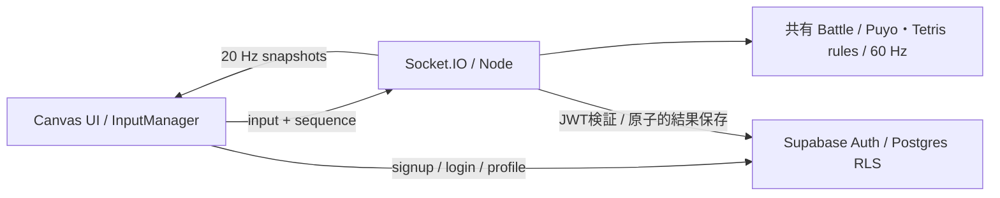

# オンライン構成・運用

## ローカル開発

Node.js 24.14.1で検証しています。

```sh
npm ci
```

`.env.example` を `.env.local` に、`server/.env.example` を `server/.env` にコピーして値を設定します。環境ファイルはGit対象外です。

| 配置     | 変数                      | 内容                                                            |
| -------- | ------------------------- | --------------------------------------------------------------- |
| Frontend | VITE_SUPABASE_URL         | SupabaseプロジェクトURL                                         |
| Frontend | VITE_SUPABASE_ANON_KEY    | publishable key または legacy anon key                          |
| Frontend | VITE_GAME_SERVER_URL      | ローカルは http://127.0.0.1:3001                                |
| Server   | SUPABASE_URL              | 同じプロジェクトURL                                             |
| Server   | SUPABASE_SERVICE_ROLE_KEY | secret key または legacy service_role key。ブラウザには渡さない |
| Server   | CLIENT_ORIGIN             | http://127.0.0.1:5173。複数ならカンマ区切り、末尾スラッシュなし |
| Server   | PORT                      | ローカル3001。RenderではRender提供値                            |

開発用Supabaseプロジェクトに `supabase/migrations/` のSQLをファイル名順に適用してください。CLIでlink後 `supabase db push`、またはSQL Editorで適用できます。既存本番には適用済みファイルを再実行しないでください。

**開発サーバーには別のSupabaseプロジェクトを使ってください。** 1プロジェクトにつきシミュレーションサーバーは1台です。起動時に既存の進行中試合・大会を中断扱いにし、古いサーバーの書き込みを遮断します。本番DBを使ったローカルサーバー起動は本番対戦を中断します。

別々のターミナルで実行します。

```sh
npm run dev:server
npm run dev
```

環境変数変更後はViteを再起動します。本番形式の起動は次のとおりです。

```sh
npm run build
npm run build:server
npm run start:server
```

CPU・LOCAL 2Pだけなら環境変数・サーバー・Supabaseは不要です。

## Supabase

公開プロジェクト名 PuyoTeto / ref `fmfaoxcxuaaeypzompyc` / Tokyo / Free。認証はメール・パスワード方式で、メール確認を維持しています。確認後、ブラウザがセッションを保存・更新します。公開名は英数字・アンダースコア3〜20文字で、大文字小文字を区別せず一意です。

- `profiles`: Auth作成トリガー、公開ユーザー名・通算勝数。本人のusernameだけ変更可能。
- `friendships`: 将来のフレンドUI用。本人間の申請・承認だけ許可。UIは今回の対象外。
- `competitions` / `competition_members`: 大会状態・参加者履歴。公開一覧と本人の参加履歴だけ参照可能。
- `matches`: 参加者・勝者・終了理由。本人が参加した試合だけ参照可能。
- 全公開テーブルにRLS。一般ユーザーは勝数・試合結果・大会を書き込めません。
- privateスキーマのepochとサービス専用RPCにより、結果の二重保存と旧プロセスの書き込みを防止します。

本番のSite URLとRedirect URLsはともに `https://puyoteto-online.onrender.com` に設定済みです。開発用の別プロジェクトにはlocalhostの正確なoriginを登録します。メール確認は有効のままです。

### 確認メール（Brevo）

2026-09-30、ユーザーがBrevoの電話番号確認・SMTPキー作成・Supabaseへのキー保存を完了。Brevo relay有効、Supabase SMTP有効の保存状態を確認しました。設定は次のとおりです。

| 項目             | 設定                                                        |
| ---------------- | ----------------------------------------------------------- |
| Host             | smtp-relay.brevo.com                                        |
| Port             | 587                                                         |
| Username         | BrevoのSMTP画面に表示されるLogin                            |
| Password         | BrevoのSMTPキー。APIキー・Brevoログインパスワードは使わない |
| Sender           | Brevoで確認済みの送信元 / 表示名 PuyoTeto                   |
| Minimum interval | 同じユーザーへの再送は60秒間隔                              |

SMTPキーはSupabase DashboardのAuth → Emails → SMTP Settingsだけに保存します。`VITE_*`、Renderのゲームサーバー、Gitには入れません。現時点では独自送信ドメインは未設定です。実受信・確認リンクの検証結果は [QA.md](QA.md) に記録します。

送信トラブル時はSupabase AuthログとBrevo Transactionalログを確認してください。Brevoのリンク追跡が有効なら認証メールで無効にし、確認リンクが改変されないようにします。送信数を増やす際は両サービスの制限を確認します。[Supabase SMTP](https://supabase.com/docs/guides/auth/auth-smtp)、[Brevo SMTP設定](https://help.brevo.com/hc/en-us/articles/7924908994450-Send-transactional-emails-using-Brevo-SMTP)。

## 通信・状態管理



クライアントは盤面・勝敗を送信しません。接続時のJWTをSupabase Authで検証しuserIdを取得します。バージョン・入力スキーマ・連番・matchId・socketIdを検証し、入力120件/秒（burst100）、1tick最大12操作、管理コマンド30件/10秒で制限します。オリジンは正確な許可リストで照合します。秘密キー・部屋の非公開コードは公開ディレクトリには入りません。

ユーザーは一度に1つの活動に所属します。概略は `IDLE → QUEUED/LOBBY → PLAYING → RESULT → IDLE/LOBBY`。クイックキューはゲーム別。部屋参加者は各自キューへ入り、複数の1対1が同時進行します。部屋定員は4/8/16人、大会4/8人、リーグ4/6/8人です。

大会は全員の接続・準備完了後にホストが開始。暗号学的乱数でシードを並べ替え、勝者が次へ進みます。リーグは各組合せを1度だけ実行し、同じ選手の試合は重ねません。各ラウンドの結果表示後約5秒で次を開始します。得点は勝3・引分1・負0。同点者間の直接対決得点、通算勝数の順で比較し、完全に同じなら同順位・同率優勝です。

- 通信切断: ゲーム時計を止め30秒待機。同じ認証userIdの再接続で復帰。旧ソケットの入力は破棄。
- 期限超過: 切断側が敗北。両者切断なら引き分け。大会の未実施カードは棄権/不戦扱いにして停滞を防ぎます。
- 一般ルーム: ホスト退出時は残った参加者に移譲。キック/設定/閉鎖はホストのみ。
- 保存失敗: 確定結果を保持して再試行。保存が確認できるまで次の試合・再戦を開始しません。
- 結果保存: match終了・通算勝数加算・大会状態を同一DBトランザクションで更新。リトライしても加算は1回。
- サーバー再起動: 試合はserver_restart、大会はcancelled。勝数は加算しません。過去結果は残り、進行中盤面は復元しません。
- ローカル一時停止と異なり、オンラインの設定画面表示・タブ非表示では相手の対戦を止めません。

## Render

公開サイトは [https://puyoteto-online.onrender.com](https://puyoteto-online.onrender.com)、対戦サーバーは [https://puyoteto-game.onrender.com/health](https://puyoteto-game.onrender.com/health) です。両サービスはLIVE、ゲームコードは `1d2cb59`。Static Siteは `srv-dast1abbc2fs73a81u3g`、Web Serviceは `srv-dast17bbc2fs73a81ju0`。

`render.yaml` は公式JSON schemaで検証済みの再現用構成です。現在の2サービスはMCPから個別作成したため、Blueprintには接続していません。既存環境を操作するときはサービスIDを確認し、重複作成しないでください。

| 項目         | Static Site                           | Web Service                                  |
| ------------ | ------------------------------------- | -------------------------------------------- |
| 名前         | puyoteto-online                       | puyoteto-game                                |
| runtime      | static                                | node                                         |
| branch       | feat/online-multiplayer               | feat/online-multiplayer                      |
| build        | npm ci --include=dev && npm run build | npm ci --include=dev && npm run build:server |
| output/start | dist                                  | npm run start:server                         |
| health       | 静的HTML                              | /health                                      |
| Node         | 24.14.1                               | 24.14.1                                      |
| plan/region  | Static CDN                            | Free / Singapore                             |

初回はWeb Serviceの実URLをフロントエンドのVITE_GAME_SERVER_URLへ、Static Siteの実originをサーバーのCLIENT_ORIGINへ設定します。HTTPSを使用し、Socket.IOは同じ接続先のWSSを自動使用します。サーバーはRender提供PORTで0.0.0.0にbindします。

自動デプロイはoffです。進行中の対戦を中断するため、Git checkpointのpushだけではサーバーを再起動しません。更新時はテスト後にRenderで明示的にManual Deployを実行してください。VITE_*はビルド時埋込みなので、変更後はフロントエンドも再ビルドします。秘密キーはWeb Serviceの環境変数だけに設定します。

Free Web Serviceは休止からの初回接続に時間がかかります。UIは接続状況と再試行を表示します。永続状態はSupabaseにあり、Renderのローカルディスクは使いません。複数インスタンスへの水平分散は未実装です。

## 検証

```sh
npm test
npm run build
npm run build:server
npx playwright install chromium
npm run test:browser -- tests/browser/game.spec.ts
npm run test:production
```

実オンラインQAは明示実行です。`node --env-file=server/.env scripts/qa-users.mjs` は4つの専用QAアカウントをAuth admin APIで作成し、秘密情報をGit対象外 `.env.qa.json` に保存します。既存ファイルを再利用し、メールは送信しません。通常のUI・認証・WebSocket・DBを使って検証し、認証回避はありません。

PowerShell:

```powershell
$env:ONLINE_QA='1'
# 本番サイトを検証する場合だけ設定。ローカル検証時は省略。
$env:QA_BASE_URL='https://puyoteto-online.onrender.com'
npx playwright test tests/browser/online.spec.ts
# 公開サイトの両ゲームCPU戦・入力・エラーを検証（ローカルサーバーは起動しない）
node scripts/smoke-production.mjs
```

QAは実際に試合履歴・大会・QAアカウントの勝数を保存します。証拠はtest-results/（Git対象外）。物理Gamepad・SMTPの実配送・他ブラウザの制限はQA文書に明記します。
